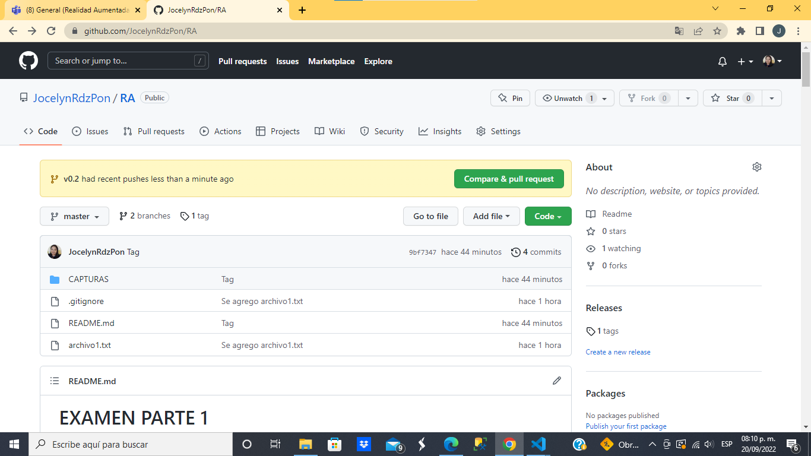
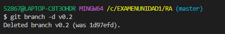

# EXAMEN PARTE 1


##  Repositorio RA
1. Primero se hizo la configuracion para definir el nombre de usuario.
2. Posicionarse en la carpeta **RA** para inicializar el repositorio.
3. Ejecutar el comando *git remote add URL* para agregar el repositorio remoto creado en GITHUB
```
$ git config --global user.name "JocelynRdzPon"

$ git config --global user.email "jocerdzp26@gmail.com"

$ cd RA

$ git init
Initialized empty Git repository in C:/EXAU1/RA/.git/

$ git remote add origin https://github.com/JocelynRdzPon/RA.git
```

 <br>

## README

1. Se creo el archivo **README.md** con el comando 
```
$ touch README.md
```
<br>

-----------------------


-----------
## Commit inicial

1. Se comienza a editar el archivo, agregando las capturas y fragmentos de comandos utilizados. 

<br>

2. Se realiza el ***commit inicial***
```
$ git add .

$ git commit -m "commit inicial"
```
<br>

--------------
## Push inicial

1. Se escribira el comando:
```
git push origin master
```
Se procede a ejecutarlo

<br>

2. Se verifica en el repositorio remoto para ver los cambios.
<br>

-------------------
## Ignorar archivos

1. Se creo el archivo *privado.txt*
```
$ touch privado.txt
```
2. Se creo la carpeta *privada*
```
$ mkdir privada
```
3. Se creo el archivo  ***.gitignore***
```
$ touch .gitignore
```
4. Se consulta el estado del repositorio y se pueede visualizar que se encuentra en *Untracked* el archivo *privado.txt*
```
$ git status
On branch master
Untracked files:
  (use "git add <file>..." to include in what will be committed)
        .gitignore
        privado.txt
```
<br>


5. Se procede a escribir en el archivo ***.gitignore*** las lineas para establecer que se ignoren los archivos ***privado.txt*** y la carpeta ***privada***
<br>

6. Al guardar el archivo *.gitignore* (CTRL+S), se vuelve a consultar el estado del repositorio y se visualiza que el archivo *privado.txt* ya no se encuentra en Staged

<br>

-----------------------
## Añadir archivo1.txt

Se creo el archivo1.txt y se realizo el add y commit
```
$ touch archivo1.txt

$ git add .

$ git commit -m "Se agrego archivo1.txt"
```

<br>

------------------
## Crear el tag v0.1 
1. Se crea el tag con el nombre ***v0.1***. 
```
$ git tag -a v0.1 -m "Tag v0.1"
```
2. Se comprueba que se haya creado correctamente con el comando:
```
$ git tag
```
<br>

------------------

## Subir el tag v0.1 

Para subir el tag creado al repositorio remoto se ejecutaran el comando:
```
$ git push origin --tags
```
 <br>

Se ejecutara y al revisar en el repositorio remoto en el apartado de *Tags*
 <br>

Se visualizara de la siguiente manera
 <br>

-----------------------
## Crear una rama v0.2 

1. Se creo la rama v0.2. 
```
$ git branch v0.2
```
 <br>
2. Posiciona tu working directory en esta rama.
```
git checkout v0.2
```
 <br>

## Añadir Archivo 2.txt

1. Se añadio un archivo2.txt en la rama v0.2 con el comando:
```
$ touch archivo2.txt
```
 
 <br>

---------------

## Crear rama remota v0.2 

Subir los cambios al repositorio remoto.

Mediante el comando:
```
$ git push origin v0.2
```
 <br>

Se suben los cambios y se crea la rama remota en Github

 <br>

-------------------
## Merge directo 

1. Posicionarse en la rama master. 
```
$ git checkout master
```
2. Hacer un merge de la rama v0.2 en la rama master. 
```
$ git merge v0.2
```
 <br>

----------------

## Merge con conflicto 
1. Posicionarnos en la rama *MASTER*
```
$ git checkout master
```

2. En el ***archivo1.txt*** se escribio **Hola** y se realizo el commit
```
$ vi archivo1.txt

$ cat archivo1.txt
Hola

$ git add .

$ git commit -m "Archivo 1 MASTER"
```
 <br>
 <br>

3. Se procede a posicionarse en la rama v0.2
```
$ git checkout v0.2
```
4. En el ***archivo1.txt*** en la rama *v0.2* se escribio **Adios** y se realizo el commit
```
$ vi archivo1.txt

$ cat archivo1.txt
Adios

$ git add .

$ git commit -m "Archivo 1 V0.2"
```
 <br>

5. Posicionarse de nuevo en la rama master y hacer un merge con la rama v0.2 
 ```
 $ git checkout master

 $ git merge v0.2
 ```

  <br>
 
 ------------------
## Listado de ramas 

1. Listar las ramas con merge y las ramas sin merge. 
  <br>

----------------------
 ## Arreglar conflicto 

1. Se va arreglar el conflicto de **MERGING**, como se muestra en la imagen al realizar el merge se notifica que hay un *conflicto* en el *archivo1.txt* el cual se debe de resolver
   
 <br>

2. Para resolverlo se hizo un add y commit al archivo, una vez hechos los cambios.
> <br>

## Borrar rama 

1. Se creo un tag para almacenar lo creado en la rama *v0.2*. Se muestran los tags existentes en el repositorio.
```
$ git tag -a v0.2 -m "Tag v0.2"

$ git tag
v0.1
v0.2
```
   > <br>

1. Se elimino la rama v0.2 con el comando 
```
git branch -d v0.2
Deleted branch v0.2 (was 1d97efd).
```
 > <br>

## Listado de cambios 

Se muestra los commits con sus ramas y cambios efectuados

 > <br>

 # EXAMEN SEGUNDA PARTE

## Cuenta de GitHub 


1. Poner una foto en tu perfil de GitHub. 
2. Poner el doble factor de autentificación en tu cuenta de GitHub. 
    <br>
3. Añadir (si no lo has hecho aun) la clave pública (ssh) que se corresponde a tu equipo. 


## Uso social de GitHub 

1. Preguntar los nombres de usuario de GitHub de tus compañeros de clase, búscalos, y síguelos. 
2. Seguir los repositorios RA del resto de tus compañeros. 
3. Añadir una estrella a los repositorios RA del resto de tus compañeros. 
  <br>

## Crear una tabla 

Crear una tabla de este estilo en el fichero README.md con la información de 3 de tus compañeros de clase: 

|Nombre | GITHUB|
|-------|-------|
|AngelSebastainGarciaSosa| Ange,LSebastianGarciaSosa|
|Aisslin |diaz696|
|Geronimo Martinez|GeroimoMtz|


 

## Colaboradores 

Ponerme como colaborador del repositorio RA *mi usuario: jmav94 

  <br>

 <br>