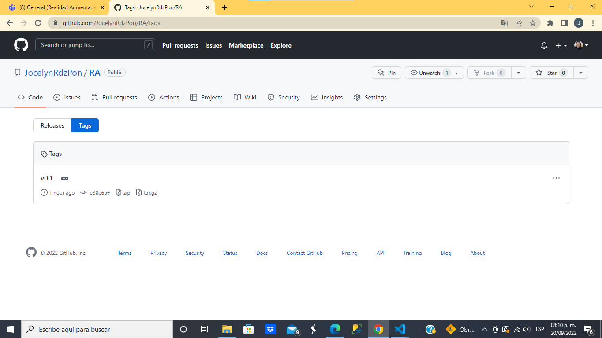
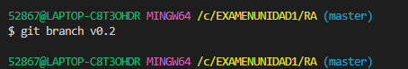

# EXAMEN PARTE 1


##  Repositorio RA
1. Primero se hizo la configuracion para definir el nombre de usuario.
2. Posicionarse en la carpeta **RA** para inicializar el repositorio.
3. Ejecutar el comando *git remote add URL* para agregar el repositorio remoto creado en GITHUB
```
$ git config --global user.name "JocelynRdzPon"

$ git config --global user.email "jocerdzp26@gmail.com"

$ cd RA

$ git init
Initialized empty Git repository in C:/EXAU1/RA/.git/

$ git remote add origin https://github.com/JocelynRdzPon/RA.git
```

 <br>

## README

1. Se creo el archivo **README.md** con el comando 
```
$ touch README.md
```
<br>

-----------------------


-----------
## Commit inicial

1. Se comienza a editar el archivo, agregando las capturas y fragmentos de comandos utilizados. 

<br>

2. Se realiza el ***commit inicial***
```
$ git add .

$ git commit -m "commit inicial"
```
<br>

--------------
## Push inicial

1. Se escribira el comando:
```
git push origin master
```
Se procede a ejecutarlo

<br>

2. Se verifica en el repositorio remoto para ver los cambios.
<br>

-------------------
## Ignorar archivos

1. Se creo el archivo *privado.txt*
```
$ touch privado.txt
```
2. Se creo la carpeta *privada*
```
$ mkdir privada
```
3. Se creo el archivo  ***.gitignore***
```
$ touch .gitignore
```
4. Se consulta el estado del repositorio y se pueede visualizar que se encuentra en *Untracked* el archivo *privado.txt*
```
$ git status
On branch master
Untracked files:
  (use "git add <file>..." to include in what will be committed)
        .gitignore
        privado.txt
```
<br>


5. Se procede a escribir en el archivo ***.gitignore*** las lineas para establecer que se ignoren los archivos ***privado.txt*** y la carpeta ***privada***
<br>

6. Al guardar el archivo *.gitignore* (CTRL+S), se vuelve a consultar el estado del repositorio y se visualiza que el archivo *privado.txt* ya no se encuentra en Staged

<br>

-----------------------
## Añadir archivo1.txt

Se creo el archivo1.txt y se realizo el add y commit
```
$ touch archivo1.txt

$ git add .

$ git commit -m "Se agrego archivo1.txt"
```

<br>

------------------
## Crear el tag v0.1 
1. Se crea el tag con el nombre ***v0.1***. 
```
$ git tag -a v0.1 -m "Tag v0.1"
```
2. Se comprueba que se haya creado correctamente con el comando:
```
$ git tag
```
<br>

------------------

## Subir el tag v0.1 

Para subir el tag creado al repositorio remoto se ejecutaran el comando:
```
$ git push origin --tags
```
 <br>

Se ejecutara y al revisar en el repositorio remoto en el apartado de *Tags*
 <br>

Se visualizara de la siguiente manera
 <br>

-----------------------
## Crear una rama v0.2 

1. Se creo la rama v0.2. 
```
$ git branch v0.2
```
 <br>
2. Posiciona tu working directory en esta rama.
```
git checkout v0.2
```
 <br>

## Añadir Archivo 2.txt

1. Se añadio un archivo2.txt en la rama v0.2 con el comando:
```
$ touch archivo2.txt
```
 
 <br>

---------------

## Crear rama remota v0.2 

